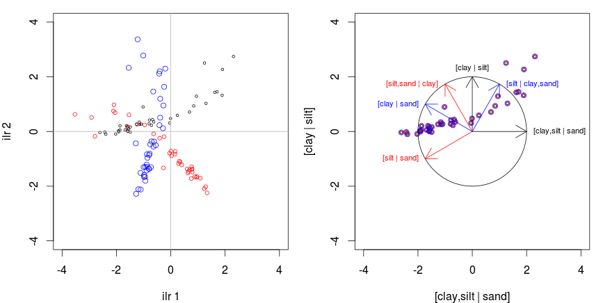

# What

**R** is a modular open source statistical programming environment mainly used for data analysis and plotting. It can be used for classical statistics, data mining and machine learning in a large range of fields: ecology, economy, geography, demography, climatology, and... soils!

# Why

* Open source
* Expandable
* Reproducible
* Popular
* Fun (no, really!)


[Source: Programming tools: Adventures with R, Nature toolbox](http://www.nature.com/news/programming-tools-adventures-with-r-1.16609)

# Resources

*Help*:

* No official, formal, centralized support team... but a large community of experts
* Search engine: http://rseek.org/
* StackOverflow: http://stackoverflow.com/questions/tagged/r
* CrossValidated: http://stats.stackexchange.com/questions/tagged/r
* Mailing lists: http://www.r-project.org/mail.html
  + https://stat.ethz.ch/mailman/listinfo/r-sig-ecology
  + https://stat.ethz.ch/mailman/listinfo/r-sig-geo
* serge-etienne.parent.1@ulaval.ca

*Other*:

* R blogs: http://www.r-bloggers.com/
* Resources proposed by the California soil resource laboratory: http://casoilresource.lawr.ucdavis.edu/software/r-advanced-statistical-package/

# `R` basics
> "Freedom is the freedom to say that two plus two make four. If that is granted, all else follows." - George Orwell

```{r}
2 + 2
```

<- is assign. = could also be used, but it is generally reserved for asigning arguments in functions. Asing a numeric value:
```{r}
x <- 2 + 2
x
```

`numeric` is a data class. There are other classes, like `character`:

```{r}
favoriteAnimal <- 'Jackalope' # comment: you can use ' ' or " "
favoriteAnimal
```

The `factor` class:

```{r}
soilOrder <-  factor(c("Brunisolic", "Chernozemic", "Organic", "Podzolic", "Unclassified"))
soilOrder
```

The boolean, or `logical` class:

```{r}
isR <- TRUE
isR
```

`function` class:
```{r}
powerRanger <- function(x, power) {
  y <- range(x^power) # range is a built in function
  return(y)
}
powerRanger(x = seq(from = 2, to = 10, by = 1), power = 2) # x is a vector, seq is a built in function
```

## Vector and matrices

Vectors and matrices are containers for a single data class:
```{r}
vectorNum <- c(2, 6, 1, 7, 8)
vectorNum

vectorChar <- c(2, 6, 'coffee', 7, 8)
vectorChar

vectorFactor <- factor(c('tea', 'tea', 'coffee', 'water', 'tea'))
vectorFactor

matrixNum <- matrix(c(1, 1,-1,
                      1,-1, 0),
                    byrow = TRUE,
                    ncol = 3)
matrixNum
```

## Lists and data frames

Lists (`list`) are collections of heterogeneous data. They are very useful to store function outputs in loops, like the output of anovas or linear regressions. Data frames (`data.frame`) is a list of vectors with equal length. They are used for handling tables.

```{r}
listOfThings <- list(order = factor(c("Brunisolic", "Chernozemic", "Organic", "Podzolic", "Unclassified")), 
                     numValues = c(2, 4, 1),
                     description = 'This list contain uninformative things.')
listOfThings
listOfThings$order

soilTable <- data.frame(order = factor(c("Brunisolic", "Chernozemic", "Organic", "Podzolic", "Unclassified", "Organic")),
                        var1 = rnorm(6, 2, 4),
                        var2 = runif(6, 0, 10))
soilTable
soilTable$order
```

## RStudio

**R** can be used with only a terminal and a text editor, but GUIs are useful. I highly recommend **RStudio**, an open source interface for **R** developed and supported by an eponym commercial enterprise. It can be downloaded from: http://www.rstudio.com/.


Other interfaces: RGUI (default in Windows versions of R), [Jupyter](http://jupyter.org/), RCommander, [RkWard (Linux only)](https://rkward.kde.org/), [Deducer](http://www.deducer.org/pmwiki/pmwiki.php?n=Main.DeducerManual), [JGR](http://rforge.net/JGR/), etc.

## Importing data in `R`

Built in data:

```{r}
data(cars)
summary(cars)
boxplot(cars, col = c('red', 'blue'))
```

Import data:

```{r}
data <- read.csv("data/mango.csv", sep = ";", dec = ".", header = TRUE)
```

## Operations

### Selection (columns) and filter (rows)

```{r}
dataHead <- head(data)
dataHead

dataHead[3, ] # filter row 3
dataHead[, 1] # select column 1
dataHead[, 1:3] # keep only columns 1 to 3 included. 1:3 is a shortcut for seq(from = 1, to = 3, by = 1)
dataHead[, -c(1:3)] # remove columns 1 to 3
dataHead$rdt.kg.Plante # $ for data.frames and lists, not matrices
dataHead[c('Cultivar', 'rdt.kg.Plante', 'sol.M.O.g.dm3')]
dataHead[1:4, c('Cultivar', 'rdt.kg.Plante', 'sol.M.O.g.dm3')]

colnames(dataHead)
```

### Math and stats
+, -, *, /, ^

```{r}
dataHead * 3 # multiply all cells by 3: makes no sense, but worth trying
apply(dataHead[c('sol.K.mmolc.dm3', 'sol.Ca.mmolc.dm3')], 1, sum)
apply(dataHead[c('sol.K.mmolc.dm3', 'sol.Ca.mmolc.dm3')], 2, mean)
cov(dataHead[, c(29:39)])
dataHead$fol.Fv <- 1000 - apply(dataHead[, c(29:33)], 1, sum) # change values of a column
dataHead
```

## Basic plot
```{r}
plot(data[, c(29:33)])
plot(x = data$fol.P.g.kg, y = data$rdt.kg.Plante, col = data$Cultivar,
     main = "Effect of Foliar P on yield", xlab = "Foliar P (g/kg)", ylab = "Yield (kg/tree)") # col, the color, is defined by a factor column
```

## Install and load packages

Packages can be installed and loaded by using the "Packages" tab in RStudio. To install, click install and write the name of the package to install (internet connection needed). You can also use the <install.packages> function directly in the console. To load a package, you check the corresponding box. However, since you have to load your packages at each session, it is easier to specify the packages to load in your code.

```{r}
# install.packages('nortest')
library(nortest)
```

Suggested packages (nonexhaustive):

* `ade4` and `vegan` for ecological analysis
* `aqp` for pedology analysis
* `caret` for machine learning
* `compositions` for CoDa
* `dplyr` a new way to work with `R`
* `ggplot2` high quality plots, including maps
* `gstat` for geostatistics
* `ggtern` ggplot for ternary diagrams
* `meta` and `metafor` for meta-analysis
* `mvoutlier` for outlier detection
* `reshape2` organize data for `ggplot2`
* `robCompositions` robust imputations for CoDa
* `soiltexture` for guess what
* `zCompositions` for handling zeros in CoDa

# CoDa in `R`

## Preprocessing: Exploration of our data set and prepare for analysis

Compositional data sets must be free of missing values and zeros. Both can be imputed in `R` without prior data transformation, because packages `robCompositions` (missing values) and `zCompositions` (zeros) already include CoDa compliant procedures. On the other hand, outlier detection routines must be run across transformed values.

### Variables to consider as parts of the simplex

```{r}
varLeaf <- c("fol.N.g.kg", "fol.P.g.kg", "fol.K.g.kg", "fol.Ca.g.kg", "fol.Mg.g.kg") # make sure units are consistent!)
parts <- data[varLeaf]
```

The data set is exempt of any zeros or missing values. Let's **replace small values by zeros**.

```{r}
apply(parts, 2, min)
```

We could assume, for this tutorial, that detection limit is 0.7 for all parts,

```{r}
parts[parts < 0.7] <- 0
apply(parts, 2, min)
sum(parts == 0) # in a Boolean sum, a FALSE is 0 and TRUE is 1. The sum is the number of TRUEs

countZero <- function(x) {
  sum(x == 0, na.rm = TRUE)
}

# number of zeros per column
apply(parts, 2, countZero)

# lines where at least one zero is encountered
isZeroRow <- apply(parts, 1, function(x) any(x == 0, na.rm = TRUE))

```

There are now some zeros in the P column. Now, let's **add missing values (NA)**.

```{r}
set.seed(7) # to make sure every random run returns the same result

nbNA <- 10
for (i in 1:nbNA) {
  parts[sample(x = 1:nrow(parts), size = 1),
     sample(x = 1:ncol(parts), size = 1)] <- NA
}

countNA <- function(x) {
  sum(is.na(x), na.rm = TRUE)
}

# number of zeros per column
apply(parts, 2, countNA)

# lines where at least one zero is encountered
isNaRow <- apply(parts, 1, function(x) any(is.na(x), na.rm = TRUE))

```


### Missing values

The script to impute missing value doesn't like zeros. We remove the lines tagged with a `TRUE` value in the `isZeroRow` vector.

```{r}
library(robCompositions)

partsNA <- parts
partsNA[!isZeroRow, ] <- impKNNa(parts[!isZeroRow, ], method = 'knn', k = 3, metric = 'Aitchison')$xImp # ! inverses a Boolean and $xImp gets the imputed matrix

anyNA(partsNA)

rbind(parts[isNaRow, ][1, ], partsNA[isNaRow, ][1, ])

```

This procedure can't be applied on lines containing both at least a zero and at least a missing value. If that row is not so important, you might remove it. If it is, you might first impute the zero as a fraction of 65% of the detection limit.

### Zeros

Three kind of zeroes can be identified:

* Rounded zeroes: concentration below detection limit
* Count zeroes: undetected count data (sample size too small)
* Essential zero: true zero.
** Observed termites in permafrost or diamonds in podzols or votes for the Bloc québécois in Calgary-Centre: is this variable important?
** Zero spending in alcohol in a budget of a person that strictly does not drink: is this observation important (any example in soil science)?


```{r}
library(zCompositions)
partsNAZ <- lrEM(X = partsNA, label = 0, dl = rep(0.7, times = ncol(parts)), rob = TRUE, delta = 0.65)
any(partsNAZ == 0)

rbind(partsNA[isZeroRow, ][1, ], partsNAZ[isZeroRow, ][1, ])
```

## CoDa transformation

Now that the data set is clean, close the simplex.

```{r}
library(compositions)
partsNAZ$Fv <- 1000 - apply(partsNAZ, 1, sum)
head(partsNAZ)

comp <- acomp(partsNAZ)
comp[1:10, ]
colnames(comp) <- c('N', 'P', 'K', 'Ca', 'Mg', 'Fv')
apply(comp, 1, sum)[1:10]
```

Data transformation.

```{r}
addLR <- alr(comp)
cenLR <- clr(comp)

sbp <- matrix(c(1, 1, 1, 1, 1,-1,
                1, 1,-1,-1,-1, 0,
                1,-1, 0, 0, 0, 0,
                0, 0, 1,-1,-1, 0,
                0, 0, 0, 1,-1, 0),
              byrow = TRUE, ncol = 6)
colnames(sbp) <- colnames(comp)
sbp
psi <- gsi.buildilrBase(t(sbp))
isoLR <- ilr(comp, V = psi)
CoDaDendrogram(comp, V = psi)
```

Custom functions.

```{r}
source("scripts/ilrDefinition_1.2.R")
source("scripts/codadend_dev_1.4.R")

colnames(isoLR) <- ilrDefinition(sbp, side = "-+")
colnames(isoLR)

CoDaDendrogram2(comp, V = psi,  equal.height = TRUE, show.range = TRUE, type = "density", group = data$Cultivar, range = "auto")

CoDaDendrogram2(comp, V = psi,  equal.height = TRUE, show.range = TRUE, type = "conf", conf.level = 0.95, group = data$Cultivar, range = "auto")

CoDaDendrogram2(comp, V = psi,  equal.height = TRUE, show.range = TRUE, type = "boxplot", group = data$Cultivar, range = "auto")

```

Why label balances as [Denominator group | Numerator group] and not Numerator/Denominator? The positive balance leans toward the numerator and reversely. Conventionnaly, in 2D, the positive side is on the right and on top. Graphically, placing the numerator on the right seemed easier to interpret.

```{r}
library(ggplot2)
library(reshape2)
isoLR.df <- data.frame(Cultivar = data$Cultivar, isoLR[, -1])
colnames(isoLR.df) <- c('Cultivar', colnames(isoLR)[-1])
isoLR.gg <-  melt(isoLR.df, id = "Cultivar")

ggplot(isoLR.gg, aes(x = Cultivar, y = value)) +
  facet_grid(. ~ variable, scales = 'free') +
  geom_boxplot() +
  coord_flip()
```

### Outliers

As written previously, outliers are preferably detected across transformed data.

```{r}
plot(comp)
plot(comp, center = TRUE, scale = TRUE)

library(mvoutlier)
isIN <- sign1(partsNAZ, qcrit = 0.975)$wfinal01 # lower qcrit are more severe
sum(isIN == 1)/length(isIN)

plot(comp, center = TRUE, scale = TRUE, col = factor(isIN))
plot(data.frame(comp), col = factor(isIN))
```

## Back transformations

```{r}
addLR_mean <- apply(addLR, 2, mean)
cenLR_mean <- apply(cenLR, 2, mean)
isoLR_mean <- apply(isoLR, 2, mean)

alrInv(addLR_mean)
clrInv(cenLR_mean)
ilrInv(isoLR_mean, V = psi)
mean(comp) # because comp has class acomp, mean is in fact mean.acomp, a special function from the compositions package
apply(partsNAZ, 2, mean) / 1000 # the biased mean
```

# Soils-specific applications of CoDa in `R`

```{r}
library(compositions)
data("ArcticLake")
```

## Ternary diagrams

```{r}
plot(acomp(ArcticLake[, 1:3]))

library(ggtern) # http://www.ggtern.com/
aldf <- data.frame(ArcticLake) # ggplot (upon which ggtern is base) only work with data.frames

ggtern(data = aldf, aes(y = clay, x = sand, z = silt)) +
  theme_bw() + # publication friendly theme
  coord_tern(L="x",T="y",R="z") +
  geom_point(aes(colour = depth), size = 4)
  
library(soiltexture)
alst <- aldf
colnames(alst) <- c('SAND', 'SILT', 'CLAY', 'DEPTH') # conform names
apply(alst[, 1:3], 1, sum) # not exactly summing to 1.
alst[, 1:3] <- unclass(acomp(alst[, 1:3], total = 100))

TT.plot(class.sys = "USDA.TT",
        tri.data = alst,
        cex.lab = 0.8, 
        cex.axis = 0.8)

TT.plot(class.sys = "CA.FR.TT",
        class.p.bg.col  = TRUE,
        tri.data = alst,
        z.name = 'DEPTH',
        cex.lab = 0.8, 
        cex.axis = 0.8)

textClass <- TT.points.in.classes(
  tri.data    = alst,
  class.sys   = "CA.EN.TT",
  PiC.type    = "t"
)

data.frame(ArcticLake, textClass)[1:15, ]

```

## Regression

How texture varies with the depth of the profile

```{r}
plot(x = ArcticLake[, 1], y = -ArcticLake[, 4], col = 'red',
     xlab = "Textural class proportion",
     ylab = "Depth (cm)")
points(x = ArcticLake[, 2], y = -ArcticLake[, 4], col = 'green')
points(x = ArcticLake[, 3], y = -ArcticLake[, 4], col = 'blue')

comp <- acomp(ArcticLake[, 1:3])
sbp <- matrix(c(1, 1,-1,
                1,-1, 0),
              byrow = TRUE,
              ncol = 3)
psi <- gsi.buildilrBase(t(sbp))

bal <- ilr(comp, V = psi)

lm1 <- lm(bal[, 1] ~ ArcticLake[, 4])
lm2 <- lm(bal[, 2] ~ ArcticLake[, 4])

predBal1 <- predict(lm1)
predBal2 <- predict(lm2)

predComp <- unclass(ilrInv(cbind(predBal1, predBal2), V = psi)) * 100

lines(x = predComp[, 1], y = -ArcticLake[, 4], col = 'red')
lines(x = predComp[, 2], y = -ArcticLake[, 4], col = 'green')
lines(x = predComp[, 3], y = -ArcticLake[, 4], col = 'blue')

plot(comp)
lines(acomp(predComp), col = 'violet')
```

The predicted composition would have been the same no matter how the SBP was designed. Why? Because switching from a SBP to another just rotates the axes of a factor of 60 degrees from the origin.



Source code: `scripts/ilr-sbp-rotation-axe.R`

## PCA

We use the Hydrochem dataset provided by the `R` compositions package, which, as described in the help file, "*contains a hydrochemical amount/compositional data set obtained from several rivers in the Llobregat river basin, in northeastern Spain.*".

```{r}
library(compositions)
data("Hydrochem")

parts <- Hydrochem[, 6:19]
parts$Fv <- 1e6 - apply(parts[, 1:14], 1, sum)
comp <- acomp(parts)

sbp <- read.csv('data/sbpHydrochem.csv', sep = ';', header = TRUE)
psi <- gsi.buildilrBase(t(sbp))
bal <- ilr(comp, V = psi)
colnames(bal) <- ilrDefinition(sbp, side = '-+')
CoDaDendrogram(comp, V = psi)
```

Many axis reduction techniques can be applied to this dataset. The obviously most well-known and common axi reduction technique is the principal component analysis. The `base` package contain the necessary functions for PCA. But when it comes to plotting results and going further, I recommend the use of the `vegan` package.

```{r}
# install.packages("vegan")
library('vegan')

pcaHydrochem <- rda(bal, scale = FALSE) # scale = FALSE: ilr are geometrically normalized.

scl <- 2 # Focus on the angle between descriptors
par(mar = c(4, 4, 1, 1))
plot(pcaHydrochem, type = "n", scaling = scl)
points(pcaHydrochem, display = "sites", col = Hydrochem$River, scaling = scl,
       pch = 16, cex = 0.8)
points(pcaHydrochem, display = "species", scaling = scl, cex = 0.5, col = "darkcyan")
text(pcaHydrochem, display = "species", scaling = scl, cex = 0.8, col = "black")
legend("topright", legend = levels(Hydrochem$River), bty = "n",
                      col = factor(levels(Hydrochem$River)), pch = 16)
```
